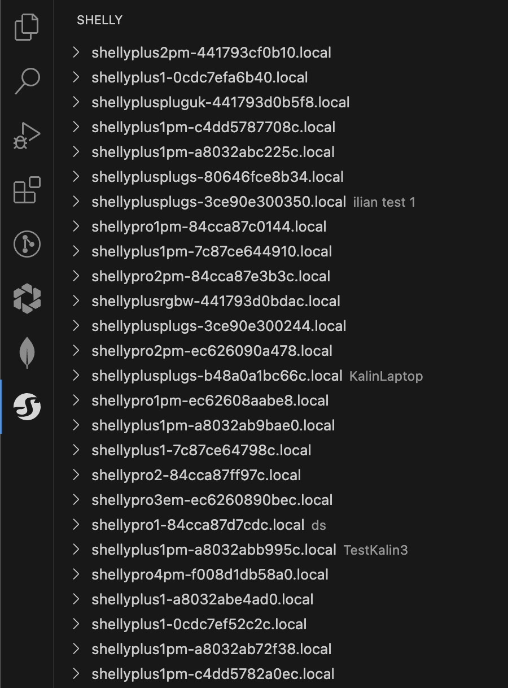
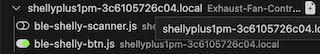
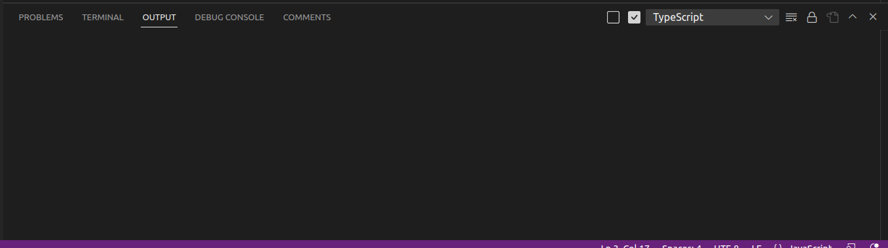
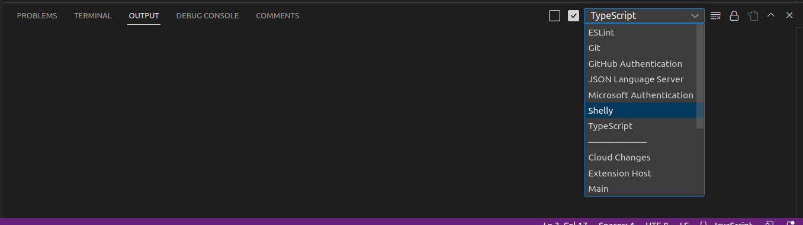
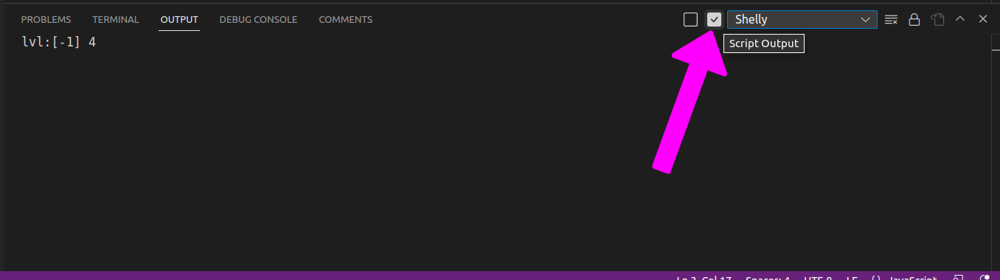
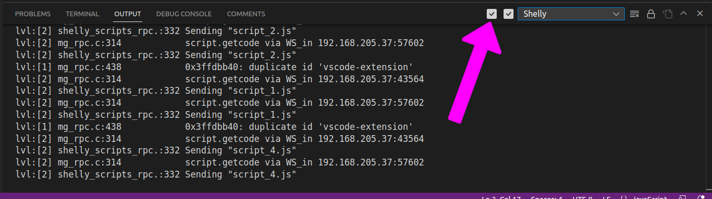
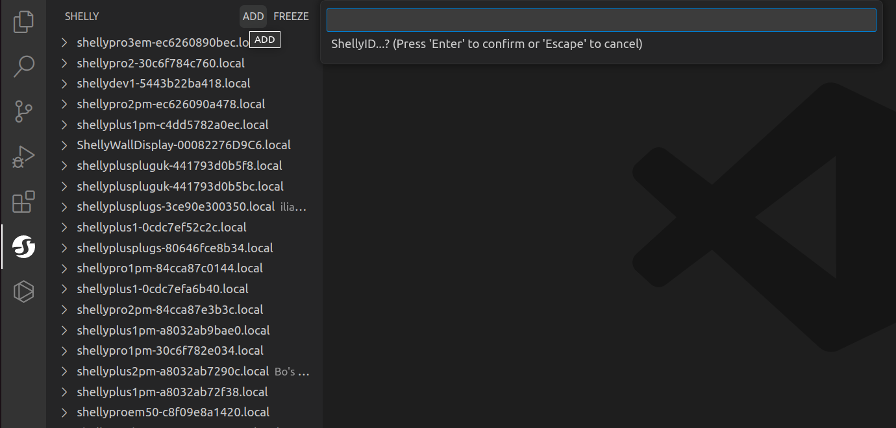

# Shelly script editor VSCode extension

A tool providing easy Shelly script editing from within VSCode. Code editing flexibility, code hints, highlighting, auto complete and method parameters hints.

# Features

- Intellisense - code completion, snippets, parameter info, member list
- Seamless script editing within VSCode
- Auto discovery of Shelly devices within a local network (mDNS)
- Run and stop scripts
- Debug with in context evaluation and log

# Device discovery

mDNS is used for finding Shelly devices in the local network. You will find all matching devices in the left part of the screen. You can find all device script once you open the device in this view. 

# Script editing

Edit the script by clicking on it. Saving the file would upload it to the chosen Shelly device. 

# Script output 
Once you've opened the script that you'd like to debug you will see the following in the console output tab:

From the dropdown menu choose Shelly.

You see two checkboxes in the output. If the right one is checked the console will contain only messages from the debug log of the active Shelly device.
If the left one is checked the console will contain every notification except for the mentioned above. If both are checked all notifications will be shown.

# Add devices manualy

If a problem with the device discovery arises use the manual addition - click on the "ADD" button and enter the IP address of the device in the input box that is to appear. You have to be connected to the device or a network to which the device is connected.

# Known limitations
- Devices protected with authentication are not accessible at the moment.
- Some windows devices might have problems with mDNS discovery. Use the manual add option if such issue is to appear.